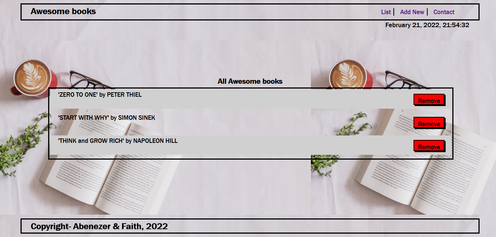

# Awesome books



> This is a team project in the Microverse second Module. The project is a book application that enables a user to add and remove books to a list

The goal of the project is to build the application using Vanilla JavaScript and ES6 Modules.   
Click [here](https://abenezer-tilahun.github.io/Awesome-books-with-ES6/) to get a live preview of the project

#### Cloning the project
```
git clone  https://github.com/Abenezer-Tilahun/Awesome-books-with-ES6.git<Your-Build-Directory>
```

## Getting packages and debuging with Stylelint
```
npm install --save-dev stylelint@13.x stylelint-scss@3.x stylelint-config-standard@21.x stylelint-csstree-validator@1.x
```
##### For validation detection using Stylelint Run
```
npx stylelint "**/*.{css,scss}"
```
##### from parent source directory

## Getting packages and debuging with ESlint
```
npm install npm install --save-dev eslint@7.x eslint-config-airbnb-base@14.x eslint-plugin-import@2.x babel-eslint@10.x
```
##### For validation detection using Stylelint Run
```
npx eslint .
```
##### from parent source directory

## Getting packages and debuging with Webhint
```
npm init -y
npm install --save-dev hint@6.x
```
##### For validation detection using Webhint Run
```
npx hint .
```

 ## 🤝 Contributing

Feel free to check the [issues page](../../issues/).

## Authors

👤 **Author1**

- GitHub: [@githubhandle](https://github.com/Abenezer-Tilahun)
- Twitter: [@twitterhandle](https://twitter.com/AbenezerTilah11)
- LinkedIn: [LinkedIn](linkedin.com/in/abenezer-tilahun-4b4b43137)

## Show your support

Give a ⭐️ if you like this project!

## Acknowledgments

- Microverse
- My coding partners(@usorfaitheloho ))

## 📝 License

This project is [MIT](./MIT.md) licensed.